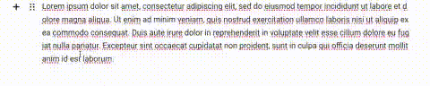

# strikethrough text Tool
Inline tool for strikethrough text fragments for the [Editor.js](https://github.com/codex-team/editor.js)



## Installation

### Install via NPM

Get the package

```shell
npm i --save @sotaproject/strikethrough
```

```shell
yarn add @sotaproject/strikethrough
```

Include module at your application

```javascript
import Strikethrough from '@sotaproject/strikethrough';
```

### Download to your project's source dir

1. Upload folder `dist` from repository
2. Add `dist/bundle.js` file to your page.

[//]: # (### Load from CDN)

[//]: # ()
[//]: # (You can load the package from [jsDelivr CDN]&#40;https://www.jsdelivr.com/package/npm/@editorjs/underline&#41; and require the script on a page with Editor.js.)

[//]: # (```html)

[//]: # (<script src="https://cdn.jsdelivr.net/npm/@editorjs/underline@latest"></script>)

[//]: # (```)

## Usage

Add a new Tool to the `tools` property of the Editor.js initial config.

```javascript
import EditorJs from '@editorjs/editorjs';
import Strikethrough from '@editorjs/strikethrough';

var editor = new EditorJS({
  // ...
  tools: {
    // ...
      strikethrough: Strikethrough
  },
});
```

## Config Params

This Tool has no config params

## Output data

Strikethrough text will be wrapped with a `s` tag with an `cdx-strikethrough` class.

```json
{
    "type" : "text",
    "data" : {
        "text" : "Create a directory for your module, enter it and run <s class=\"cdx-strikethroughs\">npm init</s> command."
    }
}
```
